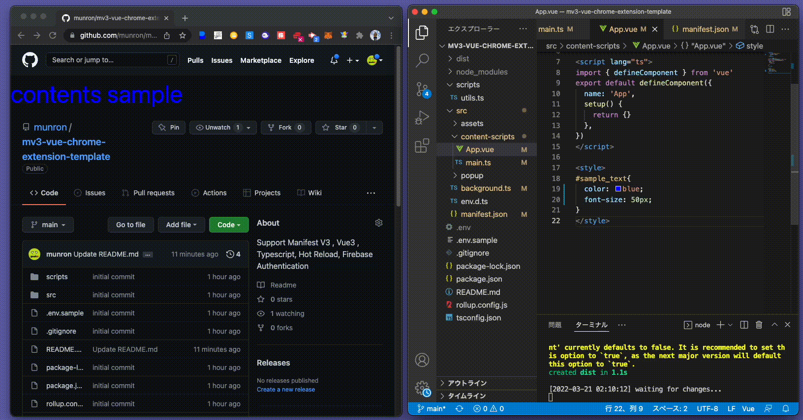

# mv3-vue-chrome-extension-template

modern chrome-extension development template

Support 
- [x] Manifest V3
- [x] Vue3
- [x] Typescript
- [x] Hot Reload
- [x] Firebase Authentication

# setup 
edit `.env.sample` and save as `.env`

# build
`npm run build`

# hot reload
`npm run dev`
